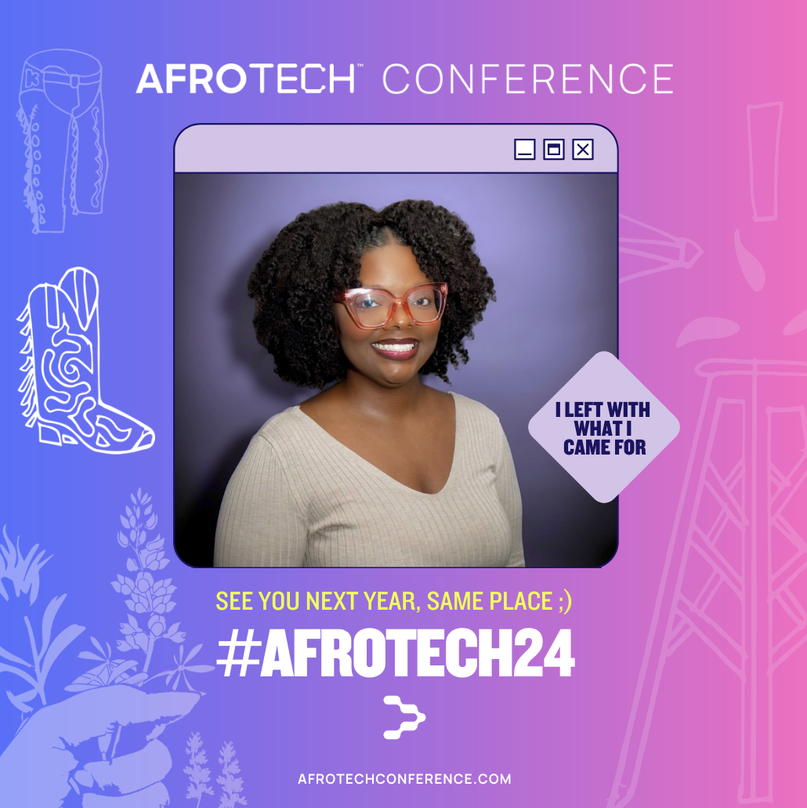
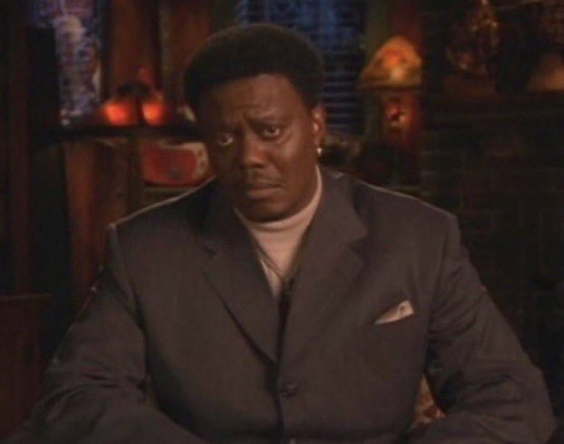
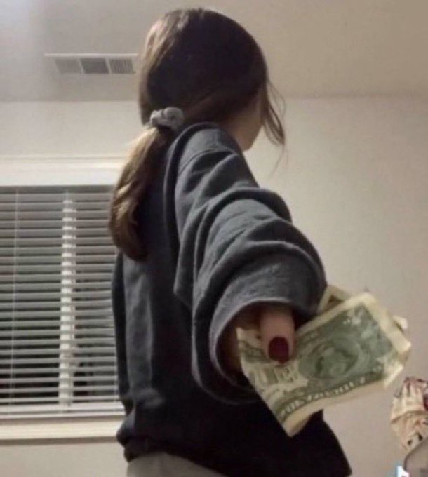

# Afrotech 2024 Suggestions for 2025
 ~  

# 📣 Well, well, well!

Now that you've read the positives about Afrotech 2024 in my , welcome to my github!

> ### Blavity's Mission Statement to keep in mind: "Connect the world to Black culture through experiences that transcend digital and physical spaces to improve the lives of Black people"

# Things that could benefit thirty seven thousand and five hundred folks in 2025:
- [x] Ensure all QR codes work smoothly for easy networking and follow-ups. For example, various QR codes weren’t working at company booths for different reasons. Some sponsors informed visitors to come back later or scan a screenshot of the code on their personal device. Others had to 'press' a button to get a working code on their phone or somewhere else. Imagine if I hadn’t asked for it—36,998 others would have missed an opportunity at that company because 3-4 reps at that booth didn’t have a backup plan or didn’t care enough.

- [x] Employees at booths should be trained and carefully vetted for empathy and a genuine interest in connecting with attendees. If representatives are from a different background, they shouldn’t just hand off booth visitors to someone who looks like them; they should still be invested in recruiting and generating company interest. Otherwise, they’re just off work for a week, people-watching and weighing down the load of others.

- [x] It would be impactful to include representatives from various backgrounds that align with the diversity of the Afrotech community. There was one company in particular with an average tenure of 20 years and zero representation of the Afrotech attendees. The only representation was their DEI officer, who couldn’t attend. Next year, I hope they bring more diverse tech talent that reflects the conference. Also, a "Wheel of Fortune"-style game giving away annual memberships would have been a fun addition to their booth. That was an oversight.

- [x] Ensure enough staff are available so employees can take breaks and stay refreshed. Nobody benefits from having just three people working a crowd of 15k job-seekers over 3.5 days with 9-hour shifts.

- [x] This is from a senior exec: A possible workshop each day on how to dress professionally (if that's your goal), the psychology behind what looks and appearances do in the job hunt and how to put your best foot forward. Yes some tech landscapes have remote-first and a lax office dress code, but that initial impression and what you're wearing counts! This will be helpful for those coming into corporate jobs for the first time, old and young alike.

- [x] A break room for corporate sponsors would be helpful, so attendees don’t interrupt their rest periods. They sometimes look on the job and are often pulled out of a lunch break to assist.

- [x] The $10-a-slice pizza in the expo hall felt a bit predatory. In contrast, Chick-fil-A did well with their stand, though their pricing likely reflected the convenience.

- [x] Suggestions for better swag include hair brushes for men and women, beard brushes, edge control and edge brushes, press-on nail glue, eyelash glue, beard oil, pens, lotion (shea, cocoa, Vaseline, etc.), socks, cultural pride apparel, sneaker cleaner, heeel protectors, eyeglass wipes, white shoelaces, hoodie pinwheels, and chapstick (think Topicals, Fenty, Burt's Bees, etc.).

Shoutout to the companies that reached into their wallets and brought along great Black-owned brands for their booth experience! (Figma x Hyper, I’m talking to you! Estee Lauder and the Tom Ford samples… yes, 10/10!) Consider your audience ;) Be mindful 🌱

- [x] Consider creating an Afrotech-specific hiring pipeline with a link and display stats (e.g., “We hired X number of attendees from Afrotech”), to showcase real impact and prove your company is genuinely committed to diversity. For instance, there's NO way your company flew you out here, had you set up a booth (especially a huge one) for there to be no special pipeline for attendee's paying good money to attend this event.

Approaching a booth only to be told by an overworked sponsor that my 'best bet is to apply by going to the career page" is heinous. Imagine buying a ticket, accomodations, a new outfit and taking off work to be told my application will be pit against a possibly bias applicant tracking system and thousands of non-attendee applicants.

^^^This is a cheat code that will make you stand out. Since this wasn’t my first rodeo 🤠, I asked companies how many people they hired from the previous year’s conference, and the ones that had numbers really stood out to me. It sparked genuine interest and hope. The companies that admitted to hiring only two people from a conference with 30k participants? I had to walk away quickly to make the best use of my time.

- [x] Again, display a diversity report and or diverse C-suite representation at the event for transparency and accountability.

- [x] Shoutouts to booths that stood out:
  - Intersystems with their Rubik’s cube pen. (It was cute, and the reps were honest and helpful)
  - Colgate with whitening strips, EltaMD, and other products!
  - Walmart with their detangling brush, totes, and nail repair kits
  - The company with Fenty products (yes!)
  - The Hyper! beauty items at Figma’s event. Although they didn’t seem to be hiring en masse because they didn’t have a booth, their offsite event was amazing!
  - Costco could have gone further by giving away memberships and having diverse representation.

- [x] Recruiters holding 30-minute conversations with attendees at booths made it challenging for others to engage. I can see limiting individual interactions to a few minutes to keep things moving. I'm concise when I'm well prepared so maybe that's what's needed. A panel on how to network! How to establish a connection or shared interest quickly, get your specific asks out of the way (from those wanting to help and to resourse-share) and moving on to the next booth. The follow-up on your own time can be more drawn out, but lines were indeed forming.

- [x] Some company booths closed early, even though the fair was scheduled until 5 pm, with some booths shutting down at 2 pm on respective days. Happy hour starts at 6pm in this city. What's the rush!

- [x] To attendees and sponsors at booths, make your LinkedIn QR code your phone’s home screen for easy access. Attendees, have recruiters take a picture of your QR code to avoid being stuck in pending requests limbo post-conference!

- [x] Ask recruiters about their company’s retention and turnover rates, and do some research on how they’re perceived in the market.

- [x] An executive badge holder inquired about mentorship opportunities or pairing potential for senior execs. They mentioned that when you're at that level, you often find yourself mentoring a bunch of people but have no one to turn to except those at the same level.

All in all, all of my personal suggestions stem from the career expo! 💼 That's where I spend my Afrotech(s)! I'm either there looking for employment op's or inquiring about tech stacks companies are using on their teams and what their pain points are in their industry and what tech to be on the lookout for. Anything else outside of that expo hall is above me! Consider some of the concerns listed above and show up to Afrotech 2025 with more intentionality and awareness and you've got everyone's support!

# In all seriousness
I’m fortunate enough to get a sponsored conference ticket, but that doesn’t diminish the value I see in an opportunity like Afrotech! I genuinely care about people, and I know ticket accessibility varies widely. With that in mind, here are a few thoughts that I, along with some friends and kind strangers who sparked up conversations with me during much-needed breaks from the packed schedule, came up with.

Search within your inbox using: "AfroTech Conference AND census". Thier post-conference survey email states: "Your voice matters, and it will shape future events for years to come." Take it!

I’m all about offering suggestions where they’ll actually be heard—I loved seeing how much the conference leaned into last year’s (2023) feedback to create an even better experience this year. See you in 2025!
